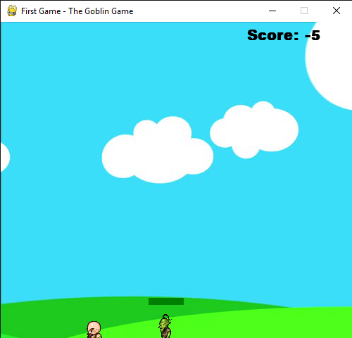

# Goblin-Game---Pygame
This game is a basic game on Pygame. You all can understand the working of the game or copy the codes. The basic necesities are:
```
Python
```

Write this in your terminal or write this your powershell or Command Prompt:
```
pip install pygame
```

</img>

To download the file, click on this link:
https://drive.google.com/file/d/1WcH5WsnAFZc0tA1bsekVzIDoDvl0zPu1/view?usp=sharing
